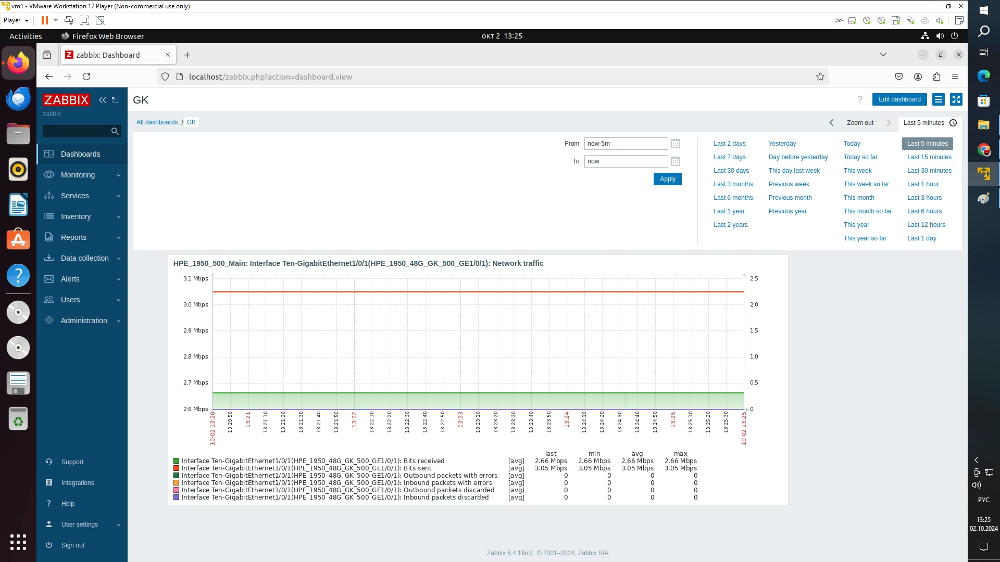

# Задание 1
## Создайте свой шаблон, в котором будут элементы данных, мониторящие загрузку CPU и RAM хоста.

***
# Задание 2
## Добавьте в Zabbix два хоста и задайте им имена <фамилия и инициалы-1> и <фамилия и инициалы-2>. Например: ivanovii-1 и ivanovii-2.

***
# Задание 3
## Привяжите созданный шаблон к двум хостам. Также привяжите к обоим хостам шаблон Linux by Zabbix Agent.
Привязка хостов в группу test.

***
# Задание 4
## Создайте свой кастомный дашборд.

***
# Задание 8* со звёздочкой
## Настройте автообнаружение и прикрепление к хостам созданного вами ранее шаблона.
Ниже на скриншотах описано добавление коммутатора сети и обнаружение с помощью discovery. Создание графика на порт, карты и добавление коммутатора, проверка пингом.

